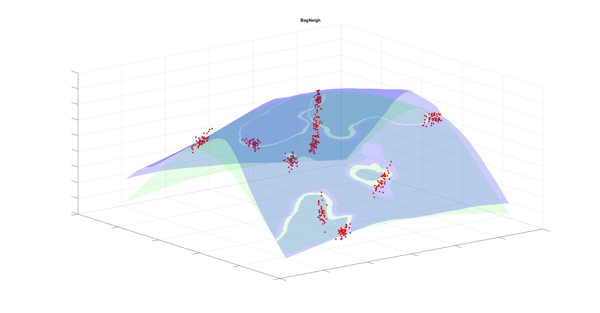

# Side-projects-and-Tools-Bag-of-Neighbors-
This repository contains the implementation of my "bag of Neighborhoods" method, along with examples, unit tests, and some graphics.

I have called this model Bag of Neighborhoods. This is a "local" bagging ensemble model, which means that the predictions are made by averaging predictors. Still, instead of being defined globally, they are defined in neighborhoods of a portion of the data. The neighborhoods are chosen randomly in each algorithm iteration until the maximum number of iterations is reached. To determine which neighborhood an element belongs to (numerical vector of characteristics) we use K-Nearest-Neighbours and the predictors will be linear regressions. Then, the prediction of each new vector will be the average of each model's prediction.

It is worth noting that although we are using only a linear model in the current implementation, the method is flexible enough to use any type of model, such as polynomials, Gaussians, or sigmoids.

### Main Interface

