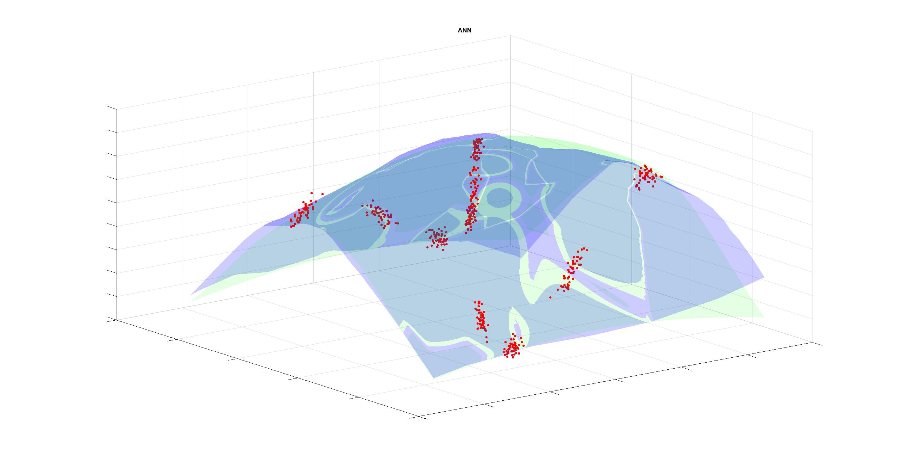

# Side-projects-and-Tools-Bag-of-Neighbors-
This repository contains the implementation of my "bag of Neighborhoods" method, along with examples, unit tests, and some graphics.

I have called this model Bag of Neighborhoods (BN). This is a "local" bagging ensemble model, which means that the predictions are made by averaging predictors. Still, instead of being defined globally, they are defined in neighborhoods of a portion of the data. The neighborhoods are chosen randomly in each algorithm iteration until the maximum number of iterations is reached. To determine which neighborhood an element belongs to (numerical vector of characteristics) we use K-Nearest-Neighbours and the predictors will be linear regressions. Then, the prediction of each new vector will be the average of each model's prediction.

It is worth noting that although we are using only a linear model in the current implementation, the method is flexible enough to use any type of model, such as polynomials, Gaussians, or sigmoids.

The following graphics show the performance of BN Vs. these 3 models: Random Forest(RF), XGBoost(XB), and a Shallow Artificial Neural Network with ReLu activation(ANN_Relu). In them, we can see how BN outperforms RF and XGB while it performs similarly to ANN_Relu. One reason is that both BN and ANN_Relu lay in the same output space, the linear by-part functions space. However, the behavior of BN is far less unexpected than that of ANN because it does not depend on a gradient descent iteration, which requires some care. For BM, results will be more or less the same if the number of iterations is high enough.  

All these graphics were generated with a version of this code in Matlab because its graphic interface is cooler. But by running the unit test main_BagNeigh, you will obtain similar results. 

### Images

